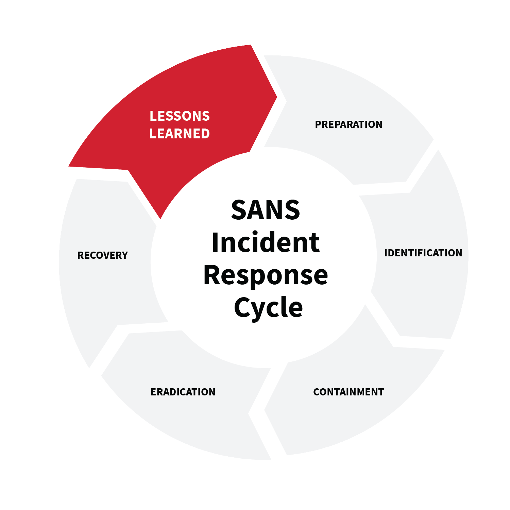

# Introduction à la forensique sous Windows

## Définition
Avant de commence cette série d'articles sur la forensique sous Windows, définissons les terme utilisés : la forensique, c'est quoi exactement ?

La réponse est plutôt simple : la forensique informatiqueest une discipline visant à collecter, analyser et interpréter des artéfacts numériques dans le d'un incident de sécurité (ou d'une enquête légale). Une sorte de version digitale des enquêteurs forensiques de "Faites entrer l'accuser" (en moins morbide, surtout).

## Le cycle forensique

Comme la plupart des domaines liés à la cybersécurité, la forensique informatique a ses propres standards d'industrie. Le PICERL (Preservation, Identification, Collection, Examination, Analysis, Reporting, and Learning) développé par le SANS Institute, est l'une de ces approches méthodiques et structurées pour mener des investigations numériques:

*	Préservation:  la première étape cruciale, l'enjeu étant de garantir l'intégrité des preuves numériques afin d'éviter toute altération. Cela implique la mise en place de mesures de préservation telles que la sécurisation de la "scène de crime" numérique, ainsi que la création de copies exactes des médias numériques pertinents (clés usb, disques durs).
*	Identification: ici, les éléments clés de l'enquête sont identifiés, notamment les systèmes, utilisateurs, et autre actifs pertinents, en plus des sources potentielles de preuves. On en profite pour créer une liste d'éléments à examiner
*	Collection :  la collecte des preuves numériques identifiées de manière légale et appropriée : copier des fichiers, d'extraire des données à partir de dispositifs, d'acquérir des images disques ou d'utiliser des outils de collecte spécialisés. L'objectif est de rassembler toutes les informations nécessaires à l'analyse ultérieure.
*	Examen : découverte des faits pertinents à l'enquête : identification et extraction d'informations importantes, récupération de fichiers supprimés, recherche de traces d'activité, analyse des journaux, etc.
*	Analyse : les preuves collectées sont analysées afin de déterminer les relations entre elles, établir/reconstituer une chronologie, et en tirer des conclusions.
*	Rapport : les résultats de l'analyse sont documentés dans un rapport détaillé. Le rapport doit être clair, précis et objectif, décrivant les actions entreprises, les méthodes utilisées et les conclusions tirées. Il doit être compréhensible par un public non technique et servir de preuve dans un contexte juridique.
*	Leçon tirées ("Learning" en anglais) : l'étape finale, qui consiste tout simplement à tirer des enseignements de l'enquête. Cela peut inclure l'évaluation des procédures utilisées, l'identification des améliorations possibles, la mise à jour des politiques de sécurité, etc.

Dans le cadre des articles suivants, je me concentrerai donc sur des environnements Windows. L'analyse forensique sur ces derniers implique (entre autres) l'examen des données stockées sur des disques durs, des clés USB, des registres système, des journaux d'événements, des fichiers de configuration, etc. Ces informations servant à réveler des détails précieux sur (toujours entre autres) les activités des utilisateurs, les programmes exécutés, les connexions réseau, les modifications de configuration, les violations de sécurité et d'autres événements pertinents.

Les premiers articles serviront à introduir certains concepts clés utilisés dans la forensique Windows, comme le registre Windows et ses clés/valeurs. Une fois ces notions critiques expliquées, je passerai ensuite à l'analyse d'images disques via des suites d'outils libres d'accès, comme Autopsy ou KAPE. Ainsi, la combinaison des deux devrait offrir une bonne introduction générale de cette discipline

Je vous laisse commencer [ici](./pages/forwin2.md) !