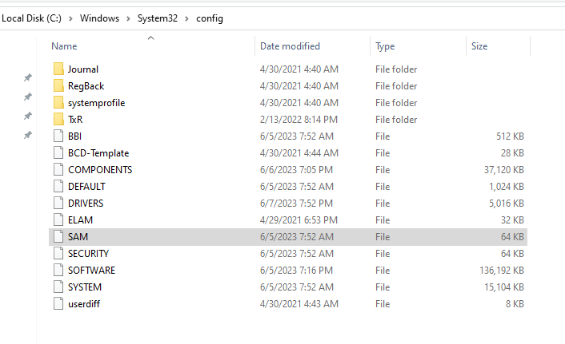

# Le registre Windows et son exploitation dans un contexte forensique

Le composant principal autour duquel s'articulent une partie non négligeable de nos efforts forensiques sur Windows est le registre Windows et les clés qui lui sont associées. Ledit registre est de facto une base de données qui sert à stocker les différentes configurations, paramètres et autres informations essentielles au bon fonctionnement du système d'exploitation. 

## Petit rappel préliminaire

### Les clés et valeurs

Les clés sont des conteneurs qui agissent comme des dossiers pour organiser les informations. Elles peuvent contenir d'autres clés ou des valeurs. Chaque clé est identifiée par un chemin d'accès unique dans la hiérarchie du registre.

Les valeurs, quant à elles, sont des éléments de données stockés à l'intérieur des clés, et contiennent elles-mêmes des données. Ainsi, dans l'exemple ci-dessous, `Ordinateur\HKEY_CURRENT_CONFIG\Software\Fonts` est la clé, `LogPixels` est la valeur, et 120 est la donnée (en hexadécimal dans notre cas)

Elles sont utilisées pour stocker des configurations, des paramètres, des préférences ou d'autres types d'informations. Chaque valeur est associée à un nom et à un type de données spécifique, tels que des chaînes de caractères, des nombres, des booléens, etc. Ces clés et valeurs ne sont pas là pour faire joli, mais sont au centre de plusieurs des fonctionnalités de Windows étant "tangibles" même pour un utilisateur lambda. Par exemple : 

*	La clé HKEY_CURRENT_USER\Software\Microsoft\Windows\CurrentVersion\Run et sa valeur "[Nom du Programme]" sert à identifier quels programmes doivent se lancer au démarrage du système d'exploitation
*	La clé HKEY_CURRENT_USER\Control Panel\Desktop et sa valeur "Wallpaper" pointe vers le chemin de l'image servant de fond d'écran utilisée sur le bureau de l'utilisateur connecté
*	La clé HKEY_CURRENT_USER\Software\Microsoft\Windows\CurrentVersion\Explorer\Advanced et sa valeur "HideFileExt" sert à déterminer si les extensions des fichiers de l'utilisateur seront affichées quand ce dernier utilisera l'explorateur de fichier par défaut de Windows

 Il est bien entendu possible de lire, modifier, ou encore supprimer ces clés et valeurs manuellement via certains outils appropriés, le plus populaire étant l'éditeur de registre par défaut déjà inclus dans Windows, regedit. 

### Les clés racines 

Il existe cinq clés "racines" utilisées par le registre Windows, et desquelles découlent toutes les autres :

*	HKEY_LOCAL_MACHINE (abrégée HKLM) contient les informations relatives à la configuration de l'ordinateur (pour tous les utilisateurs) 
*	HKEY_CLASSES_ROOT (abrégée HKCR) est une sous-clé de `HKEY_LOCAL_MACHINE\Software` . Elle permet de définir quel programme doit être utilisé pour ouvrir un type de fichier spécifique.
*	HKEY_CURRENT_USER (abrégée HKCU) contient les préférences et paramètres relatifs à l'utilisateur actuellement connecté.
*	HKEY_USERS (abrégée HKU) contient les profils de tous les utilisateurs s'étant connectés à l'ordinateur, avec un sous-dossier dédié pour chaque utilisateur
*	HKEY_CURRENT_CONFIG (abrégée HKCC) contient les informations de configuration matérielle de l'ordinateur au démarrage

### Les ruches

Les données du registre sont stockées sur le disque en tant que fichiers appellés "ruches", chacune d'entre elles représentant une partie du registre. Lorsque Windows démarre, il charge ces ruches en mémoire afin que les programmes et le système puissent y accéder rapidement. Ainsi, les modifications apportées au registre sont d'abord effectuées en mémoire, puis sauvegardées sur le disque dans les fichiers de ruches correspondants.

La majorité de ces ruches sont situées dans le répertoire `C:\Windows\system32\Config` et sont liées à un emplacement dans le registre :

*	DEFAULT, liée à HKEY_USERS\DEFAULT 
*	SAM, liée à HKEY_LOCAL_MACHINE\SAM
*	SECURITY, liée à HKEY_LOCAL_MACHINE\Security
*	SOFTWARE, liée à HKEY_LOCAL_MACHINE\Software
*	SYSTEM, liée à HKEY_LOCAL_MACHINE\System

Deux autres ruches sont en outre situées dans le répertoire de l'utilisateur actuel (donc `C:\Users\[utilisateur]`) :

*	NTDUSER.DAT, liée à HKEY_CURRENT_USER
*	USRCLASS.DAT, liée à HKEY_CURRENT_USER\Software\Classes

Et enfin, la dernière ruche nous concernant, AmCache, est située dans le dossier de compatibilité applicative (mes traductions sont décidément les meilleures) : `C:\Windows\AppCompat\Programs\Amcache.hve`

###  Les journaux de transaction et les sauvegardes du registres

Afin de garder une trace des changements apportés au registre, Windows met à disposition de l'utilisateur deux types de fichiers:

*   Les sauvegardes, situées dans le dossier `C:\Windows\System32\Config\RegBack` sont des snapshots statiques des différentes ruches créées tout les dix jours, utiles si l'on suspecte que certaines clés aient été modifiées récemment
*   Les journaux de transaction ("transaction logs" en anglais), stockés dans les mêmes répertoires que les ruches auxquels ils sont respectivement associés avec l'extension `.LOG`, sont utilisés pour garder une trace des différentes modifications effectuées sur le registre (création/modification/suppression de valeurs) 

## Exploration du registre avec Registry Explorer