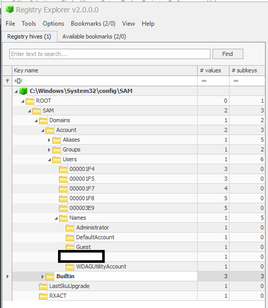

# Le registre Windows et son exploitation dans un contexte forensique

Le composant principal autour duquel s'articule une partie non négligeable de nos efforts forensiques sur Windows est le registre Windows et les clés qui lui sont associées. Ledit registre est, de facto, une base de données qui sert à stocker les différentes configurations, paramètres et autres informations essentielles au bon fonctionnement du système d'exploitation. 

## Petit rappel préliminaire

### Les clés et valeurs

Les clés sont des conteneurs qui agissent comme des dossiers pour organiser les informations. Elles peuvent contenir d'autres clés, ou des valeurs. Chaque clé est identifiée par un chemin d'accès unique dans la hiérarchie du registre.

Les valeurs, quant à elles, sont des éléments stockés à l'intérieur des clés, et contiennent elles-mêmes des données. Ainsi, dans l'exemple ci-dessous, `Ordinateur\HKEY_CURRENT_CONFIG\Software\Fonts` est la clé, `LogPixels` est une valeur, et 120 est la donnée associée à cette valeur (en hexadécimal dans notre cas)

Comme mentionné précédemment, ces clés/valeurs sont utilisées pour stocker des configurations, des paramètres, des préférences ou d'autres types d'informations. Chaque valeur est associée à un nom (comme `LogPixels` ci dessus), et au type de données qu'elle utilise, comme des chaînes de caractères, des nombres, des booléens, etc. Ces clés et valeurs ne sont pas là pour faire joli, mais sont au centre de plusieurs fonctionnalités "tangibles" de Windows, impactant l'expérience de ses utilisateurs. Par exemple : 

*	La clé `HKEY_CURRENT_USER\Software\Microsoft\Windows\CurrentVersion\Run` et ses valeurs servent à identifier quels programmes doivent se lancer au démarrage du système d'exploitation.
*	La clé `HKEY_CURRENT_USER\Control Panel\Desktop` et sa valeur `Wallpaper` pointe vers le chemin de l'image servant de fond d'écran utilisé sur le bureau de l'utilisateur connecté (et est donc utilisé par tous les programmes manipulant le fond d'écran).
*	La clé `HKEY_CURRENT_USER\Software\Microsoft\Windows\CurrentVersion\Explorer\Advanced` et sa valeur `HideFileExt` sert à déterminer si les extensions des fichiers de l'utilisateur seront affichées lorsque ce dernier utilisera l'explorateur de fichier par défaut de Windows.

 Il est bien entendu possible de lire, modifier, ou encore supprimer ces clés et valeurs manuellement via certains outils appropriés, le plus populaire étant l'éditeur de registre par défaut déjà inclus dans Windows, regedit. Pour y accéder, rien de plus simple : touche windows + r, puis entrez "regedit" et appuyez sur entrée.

### Les clés racines 

Il existe cinq clés "racines" utilisées par le registre Windows et qui contiennent toutes les autres sous-clés. Elles servent à représenter la structure logique des clés de registre sous Windows  :

*	`HKEY_LOCAL_MACHINE` (abrégée HKLM) contient les informations relatives à la configuration de l'ordinateur (pour tous les utilisateurs). 
*	`HKEY_CLASSES_ROOT` (abrégée HKCR) est une sous-clé de `HKEY_LOCAL_MACHINE\Software` . Elle permet de définir quel programme doit être utilisé pour ouvrir un type de fichier spécifique.
*	`HKEY_CURRENT_USER` (abrégée HKCU) contient les préférences et paramètres relatifs à l'utilisateur actuellement connecté.
*	`HKEY_USERS` (abrégée HKU) contient les profils de tous les utilisateurs s'étant connectés à l'ordinateur, avec un sous-dossier dédié pour chaque utilisateur.
*	`HKEY_CURRENT_CONFIG` (abrégée HKCC) contient les informations de configuration matérielle de l'ordinateur au démarrage.

### Les ruches

Les données du registre sont en réalité stockées sur le disque en tant que fichiers appellés "ruches", chacune d'entre elles représentant une partie du registre. Lorsque Windows démarre, il charge ces ruches en mémoire afin que les programmes et le système puissent y accéder rapidement. Ainsi, les modifications apportées au registre sont d'abord effectuées en mémoire, puis sauvegardées sur le disque dans les fichiers de ruches correspondants. Si nous n'avons donc pas accès à un système en temps réel, alors nous devrons aller chercher ces ruches dans l'arborescence de fichier Windows, car c'est à l'intérieur de celles-ci que se situent réellement les données sur disque qui nous intéressent. 

La majorité de ces ruches sont situées dans le répertoire `C:\Windows\system32\Config` et sont liées à un emplacement dans le registre :

*	`DEFAULT`, liée à HKEY_USERS\DEFAULT 
*	`SAM`, liée à HKEY_LOCAL_MACHINE\SAM
*	`SECURITY`, liée à HKEY_LOCAL_MACHINE\Security
*	`SOFTWARE`, liée à HKEY_LOCAL_MACHINE\Software
*	`SYSTEM`, liée à HKEY_LOCAL_MACHINE\System

Deux autres ruches sont en outre situées dans le répertoire de l'utilisateur actuel (donc `C:\Users\[utilisateur]`) :

*	`NTDUSER.DAT`, liée à HKEY_CURRENT_USER
*	`USRCLASS.DAT`, liée à HKEY_CURRENT_USER\Software\Classes

Et enfin, la dernière ruche nous concernant, `AmCache`, est située dans le dossier de compatibilité applicative (mes traductions sont décidément les meilleures) : `C:\Windows\AppCompat\Programs\Amcache.hve`

###  Les journaux de transaction et les sauvegardes du registre

Afin de garder une trace des changements apportés au registre, Windows met à disposition de l'utilisateur deux types de fichiers:

*   Les sauvegardes, situées dans le dossier `C:\Windows\System32\Config\RegBack`, sont des snapshots statiques des différentes ruches, créés tout les dix jours, et utiles si l'on suspecte que certaines clés ont été modifiées récemment.
*   Les journaux de transaction ("transaction logs" en anglais), stockés dans les mêmes répertoires que les ruches auxquels ils sont respectivement associés avec l'extension `.LOG`, sont utilisés pour garder une trace des différentes modifications effectuées sur le registre (création/modification/suppression de valeurs).

## Explorer le registre Windows

Une fois en possession de ruches (précédemment récupérées dans une hypothétique étape de collecte pour les besoins du scénario), il nous faut donc explorer celles-ci en utilisant des outils en général créés et maintenus par des tierces parties, regedit étant incapable d'importer des ruches et ne fonctionnant de toute manière qu'en temps réel (sur un système "à chaud").

### Notre couteau suisse : Registry Explorer

L'un des outils développés par George Zimmerman (un nom qui reviendra souvent dans le domaine de la forensique numérique), Registry Explorer (souvent abrévié "RegExplorer"), permet d'intéragir avec le registre Windows directement. Les utilisateurs peuvent ainsi effectuer des recherches, exporter/importer des données, et ajouter ou supprimer des clés. Il offre la possibilité d'importer plusieurs ruches dans l'outil afin de les analyser simultanément, et d'incorporer les journaux de transaction auxdites ruches afin de visualiser des versions plus récentes et "fiables" de ces dernières si le besoin s'en fait sentir.

Pour charger les ruches (peu importe que le système visé soit celui sur lequel l'enquêteur est connecté, ou une sauvegarde), il suffit de se rendre dans l'onglet "File" -> "Load hive" de Registry Explorer.

### Les premiers pas : récupération d'informations liées au système.

L'examen du registre Windows, c'est un peu comme une course, au final. Ainsi les premières clés à récupérer sont celles qui contiennent les informations les plus généralistes concernant la machine sur laquelle nous enquétons :

*   `SOFTWARE\Microsoft\Windows NT\CurrentVersion`, qui contient des informations sur la version et la configuration du système d'exploitation Windows. Ses valeurs incluent, entre autres : le numéro de version et de build, les informations relatives à la licence, au propriétaire de la machine et à l'organisation à laquelle il appartient, ainsi qu'une myriade d'autres paramètres spécifiques au système d'exploitation Windows.
*   `SYSTEM\CurrentControlSet`, une référence vers le "Control Set" (traduisible par "jeu de contrôle" en français) actuellement utilisé par le système Windows. Ce control set contient les informations matérielles/logicielles de notre ordinateur, et une partie non négligeable des artefacts forensiques analysés lors de nos enquêtes forensiques seront récupérées dans ce control set, comme par exemple ...
*   `SYSTEM\CurrentControlSet\Control\ComputerName\ComputerName`, somme toute assez explicite : contient le nom de la machine sur laquelle nous enquêtons. Il serait dommage de se tromper, après tout.
*   `SYSTEM\CurrentControlSet\Control\TimeZoneInformation`, nous informant du fuseau horaire utilisé par la machine, et donnant donc un indice quand à la géolocalisation de son utilisateur, en plus de permettre de nous situer au niveau chronologique.
*   `SYSTEM\CurrentControlSet\Services\Tcpip\Parameters\Interfaces` et `SOFTWARE\Microsoft\Windows NT\CurrentVersion\NetworkList\Signatures\Unmanaged`, listant respectivement la liste des interfaces
réseau de la machine, et la liste des réseaux à laquelle celle-ci s'est déjà connectée (à noter qu'une version 'Managed' de la seconde clé existe aussi).
*   `NTUSER.DAT\Software\Microsoft\Windows\CurrentVersion\Run`, `NTUSER.DAT\Software\Microsoft\Windows\CurrentVersion\RunOnce`, `SOFTWARE\Microsoft\Windows\CurrentVersion\RunOnce`,`SOFTWARE\Microsoft\Windows\CurrentVersion\Run`, `SOFTWARE\Microsoft\Windows\CurrentVersion\policies\Explorer\Run` : beaucoup de clés pour pointer vers la même chose, à savoir les programmes s'exécutant au démarrage de l'ordinateur (un concept notamment beaucoup utilisé comme mécanisme de persistence virale).
*   `HKEY_LOCAL_MACHINE\SAM`: cette clé, considérée comme critique, héberge la base de données SAM, qui contient les informations liés aux comptes utilisateurs s'étant déjà connectés sur cette machine . Noms d'utilisateurs, identifiants de sécurité (SID), hash de mots de passes, and appartenance à des groupes (voir l'exemple ci-dessous).

### Le jog : récupération d'informations liées à l'utilisation de fichiers/dossiers

Ensuite, savoir quels fichiers et dossiers notre utilisateur a intéragi avec est particulèrement important. Les clés à récupérer dans ce cadre-ci sont :

*   `NTUSER.DAT\Software\Microsoft\Windows\CurrentVersion\Explorer\RecentDocs\[format]` : organisées par format de fichier (.pdf, .png, .doc ), celles-ci listent les derniers fichiers avec lesquels l'utilisateur a intéragi.
*   `NTUSER.DAT\Software\Microsoft\Office\[numéro]` : contient la liste des fichiers récemment ouverts via Microsoft Office. Le placeholder "numéro" correspondant au numéro de version Office (par exemple `16.0` dans le cas de la version de 2019).
*   `NTUSER.DAT\Software\Microsoft\Windows\CurrentVersion\Explorer\ComDlg32` et ses deux sous-clés `OpenSavePIDlMRU` et `LastVisitedPidlMRU` correspondent aux boîtes de dialogue utilisées pour nous demander à quel emplacement nous souhaitons sauvegarder nos fichiers, emplacement que Windows garde ensuite en mémoire (voir l'exemple ci-dessous).
*   `NTUSER.DAT\Software\Microsoft\Windows\CurrentVersion\Explorer\TypedPaths` et `NTUSER.DAT\Software\Microsoft\Windows\CurrentVersion\Explorer\WordWheelQuery`correspondent aux recherches faites par l'utilisateur dans la barre de recherche de l'explorateur de fichier Windows.

### Le sprint : récupération d'informations relatives à l'exécution de programmes

Les clés suivantes sont utilisées afin que l'enquêteur forensique puisse savoir quels programmes ont été exécutés par l'utilisateur sur lequel nous enquêtons. Elles incluent :

*   `NTUSER.DAT\Software\Microsoft\Windows\Currentversion\Explorer\UserAssist\[GUID]\Count` liste les programmes ayant été lancés sur la machine ainsi que leur nombre d'exécutions. A noter que le `GUID` correspond à une liste fixe de GUIDs maintenue par Microsoft (et pas si bien documentée, d'ailleurs). Ainsi, `{CEBFF5CD-ACE2-4F4F-9178-9926F41749EA}` correspond très probablement à l'exécution d'applications et programmes, alors que `{F4E57C4B-2036-45F0-A9AB-443BCFE33D9F}` se charge de l'exécution de raccourcis.
*   `Amcache.hve\Root\File\[GUID du volume]` nous fournit quant à elle des informations plus détaillées sur les programmes récemment exécutés : chemin d'installation, horodatage de l'installation et/ou de l'exécution, et même les hash SHA1 (une sous-clé par programme).
*   `SYSTEM\CurrentControlSet\Services\bam\UserSettings\[SID]` et `SYSTEM\CurrentControlSet\Services\dam\UserSettings\[SID]`, où [SID] correspond au SID de l'utilisateur concerné, remplissent sensiblement le même rôle que la clé précédente (voir l'exemple ci-dessous).

### Vitesse de croisière : récupération d'informations liés au périphériques tiers

Comme vous pouvez le voir, je ne fais pas de cardio habituellement et ma tentative d'analogie sur la course à pied commence à s'essoufler, mais bon. Une fois que nous avons récoltés les informations clés des précédentes étapes, il est pertinent de se tourner vers les périphériques extérieurs ayant été connectés à ladite machine (clés USB ou disques additionels).

*   `SYSTEM\CurrentControlSet\Enum\USBSTOR` et `SYSTEM\CurrentControlSet\Enum\USB` : nommées assez explicitement, ces clés stockent les informations liés aux périphériques USB ayant été branchés au système au moins une fois (voir l'exemple ci-dessous).
*   `SOFTWARE\Microsoft\Windows Portable Devices\Devices` qui contient le GUID et le "friendly name" des périphériques USB mentionnés plus haut.

## Conclusion

Pour conclure, l'analyse du registre est un aspect essentiel du processus forensique sous Windows, et savoir lesquelles de ces clés sont les plus pertinentes est un atout pour tout analyste forensique. En attendant, votre humble serviteur a préparé une petite antisèche, disponible [en cliquant ici](https://cheatography.com/outis/cheat-sheets/forensique-windows/), et vous donne rendez-vous au prochain article (quand je saurais quoi ajouter) !