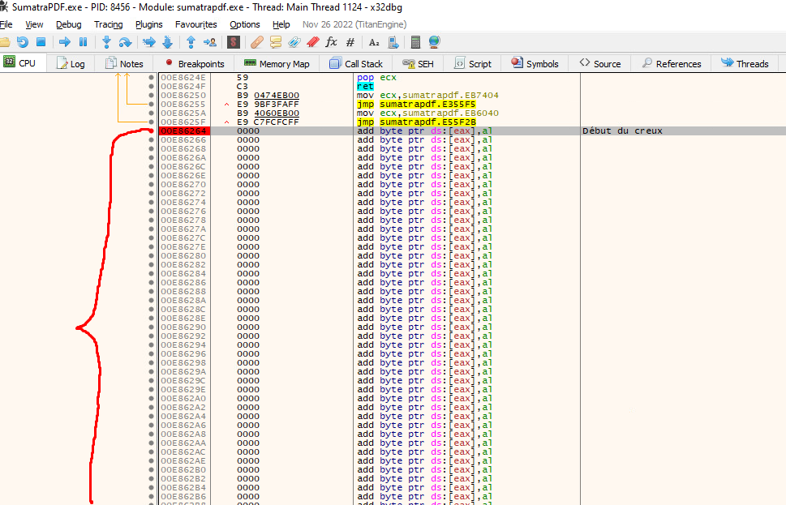

# Backdoorer un programme

Rebonjour mesdames/messieurs. Dans la continuité de cette série d'article sur le dévelopemment de malwares sous Windows, je vous propose aujourd'hui d'examiner les mécanismes utilisés pour créer des backdoors dans des exécutables légitimes. 

Mais définissons les termes : qu'est ce qu'une backdoor ? Jetons un oeil à la définition officielle française, qui utilise la traduction (somme toute littérale) "porte dérobée" :

>Dans un logiciel, une porte dérobée (de l'anglais backdoor, litt. « porte de derrière ») est une fonctionnalité inconnue de l'utilisateur légitime, qui donne un accès secret au logiciel. L'introduction d'une porte dérobée dans un logiciel à l'insu de son utilisateur transforme le logiciel en cheval de Troie.

Il existe trois manières basiques d'implémenter une backdoor dans un programme pré-existant :

-Utiliser un "creux" pré-existant dans notre binaire où se situent des octets sans aucune importance pour l'exécution du programme, et où l'on pourrait tranquillement insérer notre payload, en général dans la section .text (cf les articles sur le format de fichier PE pour un petit rappel). Le souci ? La taille de ces creux est aléatoire, et il se peut qu'ils ne soient pas assez grands pour notre payload.

-Rajouter une section dans le fichier PE. Comme ça, pas de problèmes liés à la taille de notre payload. Petit détail qui a son importance, cependant : les droits alloués à ladite section. Afin d'exécuter notre payload, celle-ci doit avoir des droits d'exécution, ce que les solutions anti-virales qui analyseront statiquement l'exécutable verront d'un très mauvais oeil

-Etendre une section pré-existante, afin de résoudre les deux soucis de place et de droits posés plus-haut. Malheureusement, cette solution introduit un problème supplémentaire ; le recalcul des différents offsets relatifs de notre fichier PE.

Nous allons quand à nous nous concentrer sur la première méthode. En utilisant un payload standard faisant pop calc.exe, et le binaire légitime du logiciel de lecture de pdf "SumatraPDF", nous allons voir dans cet article comment localiser un "creux" de taille suffisante pour notre payload dans ledit binaire, afin de véroler ce dernier

## Localiser le creux

La première étape consiste donc, en utilisant le debugger de notre choix (32dbg pour cet article), à localiser un creux de taille suffisante pour notre payload. Il existe un moyen très simple pour accomplir cela : en nous rendant dans la section .text (qui pour rappel contient les instructions qui seront exécutées par notre programme), et en défilant vers le bas pendant suffisamment longtemps, nous arrivons à un point de ladite section où il n'y a plus d'instructions à exécuter, malgré le fait que la section ne soit pas encore finie. C'est dans ce "reste", aisèment identifiable car plein d'octets vides, que nous placerons notre shellcode.

## Modifier la logique d'exécution du programme

La seconde étape, toujours dans notre debugger, consiste à placer notre payload dans le creux, puis de modifier la logique d'exécution des instructions situées dans notre programme, afin que notre payload soit exécuté sans handicaper sa fonctionnalité initiale (dans notre cas, le démarrage et l'utilisation du logiciel de lecture de PDF Sumatra). Le principe est simple :  remplacer la première instruction du programme par un saut à l'adresse contenant notre payload, sauvegarder le contexte d'exécution (registres et flags) du programme, et enfin, après l'exécution du payload, retourner aux instructions originales assurant le fonctionnement normal du programme.

Une image valant mille mots, veuillez trouvez ci dessous ce magnifique diagramme fait sous Paint par votre humble serviteur, le design graphique étant ma passion depuis toujours (non).

Pour commencer, après avoir placé un breakpoint au début de notre creux, afin de pouvoir plus facilement y retourner, nous nous rendons au point d'entrée de l'exécutable ("Entry point" en anglais), où commence l'exécution des instructions de ce dernier à chaque lancement de Sumatra. Ensuite, après avoir copié et mis de côté les premières instructions, nous remplacons la toute première instruction par un saut vers l'adresse de notre creux, via l'instruction "jmp". Cette première instruction remplacée est en l'occurrence le premier call du programme, assurant le fonctionnement normal de celui-ci. Celle-ci est suivi immédiatemment par un jmp à l'addresse 0xE54F50, intacte et non affectée par notre remplacement d'instruction. Il est donc nécessaire de mettre de côté ces deux instructions pour le moment afin de pouvoir y revenir plus tard.

 Une fois le saut effectué, juste avant l'exécution de notre payload, nous sauvegardons le contexte d'exécution originel de notre programme via les instructions "pushad" et "pushfd", servant respectivement à sauvegarder l'état des registres, et celui des flags, en les poussant sur la stack mémoire, avant de coller notre payload dans notre creux.

A ce stade là, si nous tentons de lancer l'exécutable, notre payload va s'exécuter, faire apparaître cette bonne vieille calculatrice ... et c'est tout. En effet, le payload que nous avons inséré, une fois calc.exe lancé, considère que son devoir est accompli et exécute donc un appel de sortie ("exit call" sonne mieux en anglais), mettant fin au programme. Pour avoir à la fois notre calculatrice ET l'exécution normale de Sumatra, il nous faut désormais implémenter trois choses  :

-Supprimer cet appel de sortie de notre payload, afin que l'exécution continue après l'apparition de la calculatrice
-Restaurer le contexte originel précédemment sauvegardé (registres et flags)
-Reprendre le flux d'exécution de notre programme et permettre à Sumatra de se lancer et de tourner normalement.

Commencons par repérer l'appel de sortie. La procédure la plus simple est tout simplement de se rendre au début de notre shellcode, puis de poser des breakpoints sur chaque instruction "call" afin de voir laquelle occasione l'arrêt complet du programme. 

Une fois l'appel repéré (le dernier "call", passant au préalable en paramètre sur la stack la valeur "0" et la valeur d'EBX), nous avons le choix de le contourner (en utilisant un "jmp" dans notre cas) ou de le supprimer entièrement. Cf la capture d'écran ci-dessous, commentée.

Une fois cet appel éliminé, nous pouvons désormais restaurer le contexte originel via les instructions "popad" et "popfd" qui, vous l'aurez sand doute deviné, font l'inverse du duo popad/popfd utilisé précédemment pour sauvegarder ledit contexte. Une bonne chose de faite !

Mais une fois cette tâche accomplie, revenons pour un petit moment à nos instructions sauvegardées. La toute première instruction du programme, située à l'emplacement précis de l'entry point, et que nous avions remplacée par un jmp vers notre payload, est donc un call vers l'addresse 0xE5588E. Maintenant que notre payload a été exécuté et que le contexte des registres/flags a été restauré, nous pouvons directement ré-insérer cette instruction dans notre programme, juste après le popad. Puis, afin d'assurer la continuité du programme à la fin de ce call, il nous faut créer une nouvelle instruction qui se chargera de retourner au tout début de notre programme, en "jumpant" directement sur la deuxième instruction d'origine restée intacte, le jmp vers l'addresse 0xE54F50, lui-même situé à l'addresse 0xE550D1.

Un petit gif de démonstration ci-dessous :

Et une fois toutes nos modifications finies, il ne nous reste plus qu'à appuyer sur "Patch Files" afin de les appliquer dans une copie de SumatraPDF, puis de tester le résultat !

Et voilà ! Nous avons donc pu dans cet article apprendre à backdoorer de manière somme toute assez basique un exécutable. Le prochain article, quand à lui, portera sur l'injection de code dans des processus distants. A la prochaine !