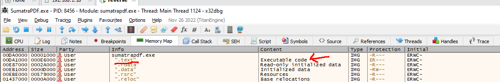

# Backdoorer un programme

Rebonjour mesdames/messieurs. Dans la continuité de cette série d'article sur le dévelopemment de malwares sous Windows, je vous propose aujourd'hui d'examiner les mécanismes utilisés pour créer des backdoors dans des exécutables légitimes. 

Mais définissons les termes : qu'est ce qu'une backdoor ? Jetons un oeil à la définition officielle française, qui utilise la traduction (somme toute littérale) "porte dérobée" :

>Dans un logiciel, une porte dérobée (de l'anglais backdoor, litt. « porte de derrière ») est une fonctionnalité inconnue de l'utilisateur légitime, qui donne un accès secret au logiciel. L'introduction d'une porte dérobée dans un logiciel à l'insu de son utilisateur transforme le logiciel en cheval de Troie.

Il existe trois manières basiques d'implémenter une backdoor dans un programme pré-existant :

-Utiliser un "creux" pré-existant dans notre binaire où se situent des octets sans aucune importance pour l'exécution du programme, et où l'on pourrait tranquillement insérer notre payload, en général dans la section .text (cf les articles sur le format de fichier PE pour un petit rappel). Le souci ? La taille de ces creux est aléatoire, et il se peut qu'ils ne soient pas assez grands pour notre payload.

-Rajouter une section dans le fichier PE. Comme ça, pas de problèmes liés à la taille de notre payload. Petit détail qui a son importance, cependant : les droits alloués à ladite section. Afin d'exécuter notre payload, celle-ci doit avoir des droits d'exécution, ce que les solutions anti-virales qui analyseront statiquement l'exécutable verront d'un très mauvais oeil

-Etendre une section pré-existante, afin de résoudre les deux soucis de place et de droits posés plus-haut. Malheureusement, cette solution introduit un problème supplémentaire ; le recalcul des différents offsets relatifs de notre fichier PE.

Il est aussi possible de combiner plusieurs méthodes à la foi ; rien ne nous empêche de 

Nous allons quand à nous nous concentrer sur la première méthode. En utilisant un payload standard faisant pop calc.exe, et le binaire légitime du logiciel vidéo "VLC", nous allons voir dans cet article comment localiser un "creux" de taille suffisante pour notre payload dans ledit binaire, afin de véroler ce dernier

## Localiser le creux

La première étape consiste donc, en utilisant le debugger de notre choix (32dbg pour cet article), à localiser un creux de taille suffisante pour notre payload. Il existe un moyen très simple pour accomplir cela : en nous rendant dans la section .text (qui pour rappel contient les instructions qui seront exécutées par notre programme), et en défilant vers le bas pendant suffisamment longtemps, nous arrivons à un point de ladite section où il n'y a plus d'instructions à exécuter, malgré le fait que la section ne soit pas encore finie. C'est dans ce "reste", aisèment identifiable car plein d'octets vides que nous placerons notre shellcode.

## Modifier la logique d'exécution du programme

La seconde étape, toujours dans notre debugger, consiste à placer notre payload dans le creux, puis de modifier la logique d'exécution des instructions situées dans notre programme, afin que notre payload soit exécuté sans handicaper sa fonctionnalité initiale (dans notre cas, le démarrage et l'utilisation du logiciel vidéo VLC). Le principe est simple ; sauvegarder le contexte d'exécution (registres et flags) du programme, puis remplacer la première instruction du programme par un saut à l'adresse contenant notre payload, et enfin, après l'exécution dudit payload, retourner aux instructions originales assurant le fonctionnement normal du programme. 

Pour commencer, après avoir placé un breakpoint au début de notre creux, afin de pouvoir plus facilement y retourner, nous nous rendons au point d'entrée de l'exécutable ("Entry point" en anglais), où commence l'exécution des instructions de ce dernier à chaque lancement de VLC :

Ensuite, après avoir copié et mis de côté les premières instructions, nous remplacons la toute première par un saut vers l'adresse de notre creux, via l'instruction "jmp". Puis, une fois le saut effectué, juste avant l'exécution de notre payload, nous sauvegardons le contexte d'exécution originel de notre programme via les instructions "pushad" et "pushfd", servant respectivement à sauvegarder l'état des registres, et celui des flags, en les poussant sur la stack mémoire.

L'étape suivante consiste ensuite logiquement à coller notre payload dans notre creux, puis, une fois celui-ci exécuté, à restaurer le contexte originel précédemment sauvegardé avec pushad/pushfd. Pour ce faire, il nous suffit d'utiliser les instructions "popad" et "popfd", qui, vous l'aurez sans doute deviné, sous les pendants inverses de pushad/pushfd.